A Ping Sweeping Wizard with Full NMAP Support

Ping sweep a 1-255 IP range, retrieve your results, proceed to execute Nmap commands with the discovered IPs.

# Author

Adam Hamilton

    GitHub
    Email

# Contributing

Contributions are always welcome!

Please refer to the contact information above to get in touch.

## Features

1. Choose between running a ping sweep or proceeding directly to Nmap.
   - IP Sweeper Wizard prompts for the first 3 octets (e.g., 192.168.10.), then performs a ping scan from 192.168.10.1 to 192.168.10.255.
   - Upon completion, a file is saved as ipsweep.<ip>.txt in the user's current working directory (e.g., ipsweep.192.168.10.txt).
2. Option to run an Nmap scan against the discovered IPs.

3. Multiple Nmap options available:
   1. Timing options (-T0 to -T6)
   2. Host scanning options (-Psauye)
   3. Script scanning options (-Sstunxfwncv)
   4. Operating system enumeration (-O)
   5. IP or Hostname options (192.168.20.5),(www.website.com)
   6. Decoy scanning options (-D RND:5,10,15,20)
   7. Top ports (--top-ports 5 to 65535)
   8. Output file options (-oNXGA)
   9. Show final nmap command and ask user before running
* Note: Using the --script (scripts.nse) assumes you have a good understanding of nmap's script engine usage.

# Feedback

Feel free to reach out with any ideas or feedback at blacklisthacker@protonmail.com.

# Run Locally

## Clone the project

```bash
  git clone https://github.com/adamhamilton44/ip-sweeper.git
```

## Go to the project directory

```bash
  cd ipsweep
```

## Run the Installer script 

```bash
  chmod +x installer.sh
  sudo bash ./installer.sh
```

## 🚀 About Me

I'm a self taught noob this was my first project i uploaded to Github.

## User Experience

- ASCII ART

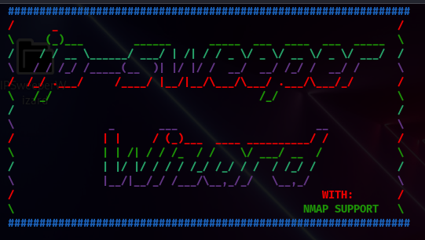

- IP-Sweeper-Wizard found ip's

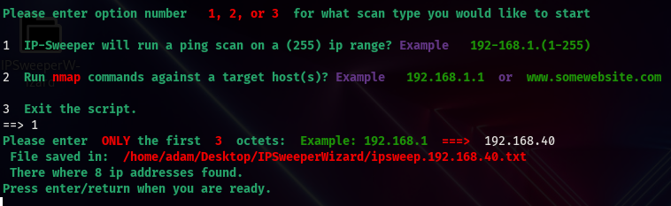

- Ping scan or nmap scan options

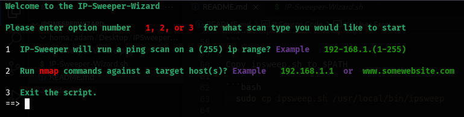

- nmap ip address or URL

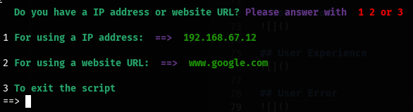

- URL options

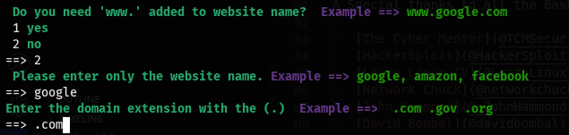

- Port options

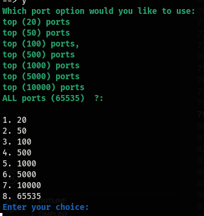

- Decoy options

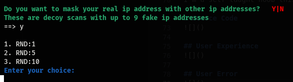

- Timing options

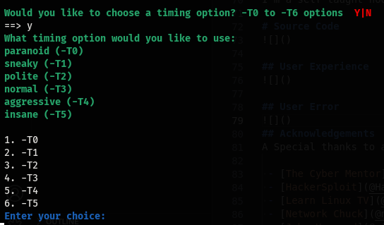

- Outfile options

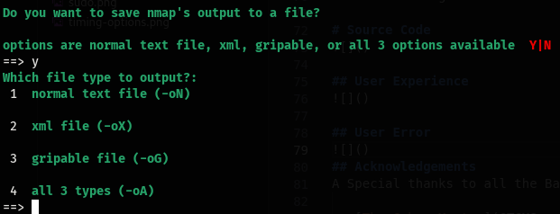

- Final command

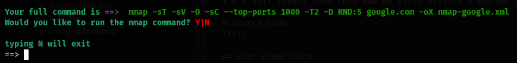

- User Error

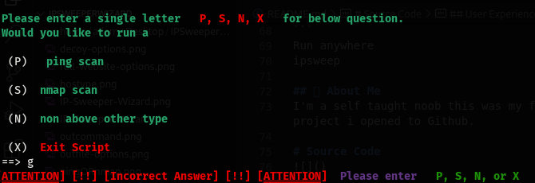

- Sudo Options

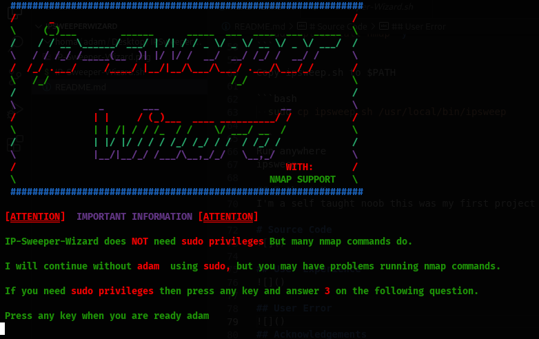


## Acknowledgements

A Special thanks to all the Bash Scripting Language Influncers that have helped me along the way.

 - [The Cyber Mentor](@TCMSecurityAcademy)
 - [HackerSploit](@HackerSploit)
 - [Learn Linux TV](@LearnLinuxTV)
 - [Network Chuck](@networkchuckacademy)
 - [John Hammond](@_JohnHammond)
 - [David Bombal](@davidbombal)

## Github Profile Sections

👩‍💻 Currently working on advancing into more complex Bash scripts.

💬  Feel free to ask me about anything.

📫 Reach me via Email: blacklisthacker@protonmail.com

⚡️ Fun fact: I am actually a professional dog trainer. [Visit my website](https://good-happy-puppy.com)

# Fund My Projects

Bitcoin: 3ENrACvnNY7AYG7HUvcdwJgZjnpoaQ9Lbt

